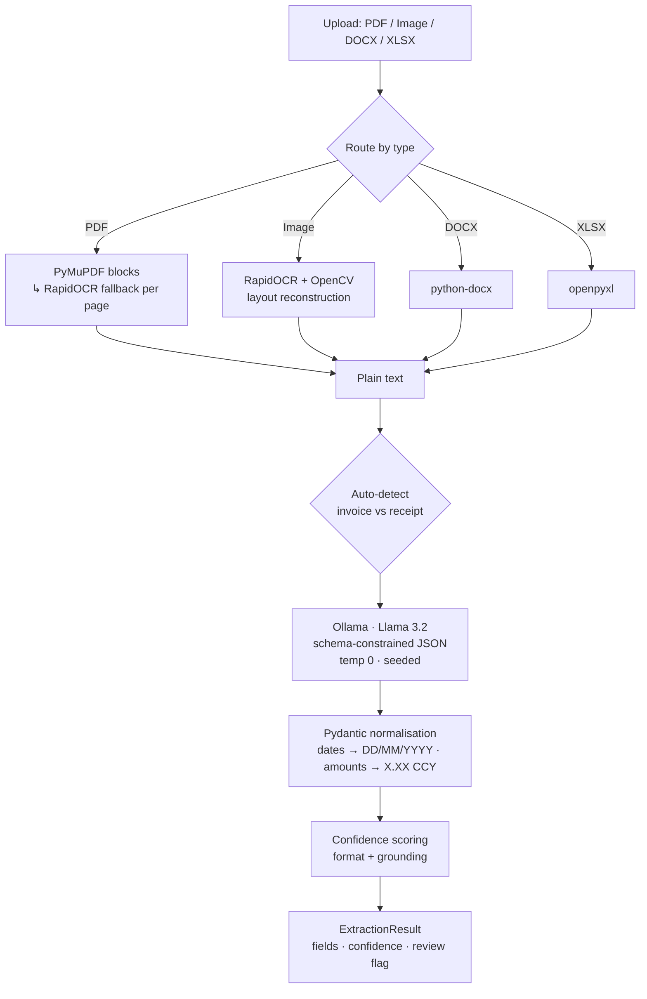

# DocuMind 🧾→ 🔣

**Self-hosted, privacy-first document intelligence.** DocuMind turns messy
financial documents — PDFs, scans, photos, Word, Excel — into clean, validated,
**confidence-scored** JSON, using a two-stage OCR + local-LLM pipeline. No cloud
APIs, no keys, no data leaving your infrastructure.


-000000)


---

## Why it's different

Most invoice extractors stop at "here's some JSON." DocuMind adds the things a
real production system needs — and that almost no comparable open-source project ships:

- **Per-field confidence scores** — every field is scored on *format validity*
  and *grounding* (does the value actually appear in the source?), giving a
  built-in hallucination guard and an auto-accept / needs-review signal.
- **Measured accuracy** — a real evaluation harness with a labelled gold set
  reports precision / recall / F1 per field. Claims, but with numbers.
- **Auto-routing** — one `/extract` endpoint classifies invoice vs receipt and
  picks the right schema; no need to know the document type up front.
- **Schema-constrained decoding** — the Pydantic schema is passed to Ollama's
  `format` parameter, so the model is constrained at the token level to emit
  valid JSON. No more "malformed JSON" failures.
- **Currency-aware normalisation** — detects £/$/€ and ISO codes, strips
  thousands separators, handles negatives, enforces `X.XX`.
- **Observability** — Prometheus `/metrics` (latency, throughput, review rate).
- **One command to run** — `docker compose up` brings up the API *and* a
  model-baked Ollama. Fully tested (37 unit tests), CI-gated.

## Architecture



Two independent services: **`documind-ocr`** (FastAPI, async, OCR + orchestration)
and **`documind-ollama`** (Llama 3.2 baked into the image). Deployable to
Kubernetes via the included Helm values.

## Accuracy

Generated by `python evaluate.py` against the labelled gold set in
`tests/fixtures/eval/` (sample numbers — regenerate on your own data):

| Field | Exact match | Precision | Recall | F1 | N |
|---|---|---|---|---|---|
| `invoiceNumber` | 1.000 | 1.000 | 1.000 | 1.000 | 4 |
| `totalInvoiceAmount` | 1.000 | 1.000 | 1.000 | 1.000 | 4 |
| `invoiceDate` | 0.750 | 1.000 | 0.750 | 0.857 | 4 |
| `supplierName` | 0.750 | 0.750 | 0.750 | 0.750 | 4 |
| `bankAccountSortCode` | 0.750 | 1.000 | 0.667 | 0.800 | 4 |
| `totalVatAmount` | 0.750 | 0.667 | 0.667 | 0.667 | 4 |
| **macro avg** | **0.833** | — | — | **0.846** | 4 docs |

The harness runs in CI as an accuracy regression guard.

## API

| Method | Endpoint | Purpose |
|---|---|---|
| `POST` | `/extract` | **Auto-detect** document type and extract |
| `POST` | `/process/invoice/` | Force the 8-field invoice schema |
| `POST` | `/process/income/expenses/invoice/` | Force the 3-field receipt schema |
| `GET`  | `/status` | Health / readiness |
| `GET`  | `/metrics` | Prometheus metrics |

All extraction endpoints accept `multipart/form-data` (`file` field) and return
the same envelope:

```jsonc
{
  "document_type": "invoice",
  "fields": {
    "invoiceNumber": "INV-2024-001",
    "invoiceDate": "15/03/2024",
    "totalInvoiceAmount": "1500.50 GBP",
    "supplierName": "Acme Corp Ltd",
    "bankAccountSortCode": "20-15-82"
  },
  "confidence": { "invoiceNumber": 1.0, "invoiceDate": 1.0,
                  "totalInvoiceAmount": 1.0, "supplierName": 0.75 },
  "overall_confidence": 0.94,
  "review_required": false,
  "currency": "GBP",
  "meta": { "model": "llama3.2:latest", "elapsed_ms": 812,
            "routing_confidence": 1.0, "text_chars": 642 }
}
```

**Supported file types:** `.pdf`, `.png`, `.jpg`, `.jpeg`, `.docx`, `.xlsx`

## Quickstart

### One command (recommended)

```bash
docker compose up --build
# API on http://localhost:8000, Ollama on http://localhost:11434
curl -F "file=@invoice.pdf" http://localhost:8000/extract
```

### Local development

```bash
# 1. Ollama + model
docker run -d -p 11434:11434 --name ollama ollama/ollama:0.15.6
docker exec -it ollama ollama pull llama3.2:latest

# 2. API
cd ocr && python -m venv .venv && source .venv/bin/activate
pip install -r requirements.txt
uvicorn ocr.src.main.main:app --host 0.0.0.0 --port 8000 --reload
```

## Testing & evaluation

```bash
pytest                 # 37 unit tests (extractors, validators, confidence, parsing)
python evaluate.py     # field-level accuracy report
```

Tests are pure-Python and mock the LLM, so the suite runs in <1s with no model.

## Tech stack

FastAPI · Uvicorn (uvloop) · Pydantic v2 · RapidOCR · ONNX Runtime · OpenCV ·
PyMuPDF · python-docx · openpyxl · httpx · Ollama · Llama 3.2 ·
prometheus-client · Docker / Compose · Kubernetes / Helm · GitHub Actions

## Project layout

```
documind/
├── docker-compose.yml          # one-command app + Ollama
├── evaluate.py                 # accuracy evaluation harness
├── ocr/                        # FastAPI + OCR + LLM client
│   └── src/main/
│       ├── main.py             # app, endpoints (incl. /extract), metrics
│       ├── classifier.py       # invoice-vs-receipt auto-detection
│       ├── confidence.py       # per-field confidence scoring
│       ├── invoice_processor/  # schema-constrained Ollama client
│       ├── model/              # Pydantic schemas + ExtractionResult envelope
│       ├── text_extractor/     # PDF / image / DOCX / XLSX extractors
│       ├── utils/              # currency + date normalisation
│       └── image_processing_utils/
├── ollama/                     # Ollama service (model pre-baked)
└── tests/                      # 37 tests + eval fixtures
```

## Roadmap

- Bounding-box overlay: render extracted fields back onto the source document.
- Batch / ZIP upload with aggregated CSV export.
- Embeddings-based document dedup and vendor matching.

---

*Built by Ayush Gour as a portfolio demonstration of an end-to-end, production-shaped AI document-processing system. MIT licensed.*
