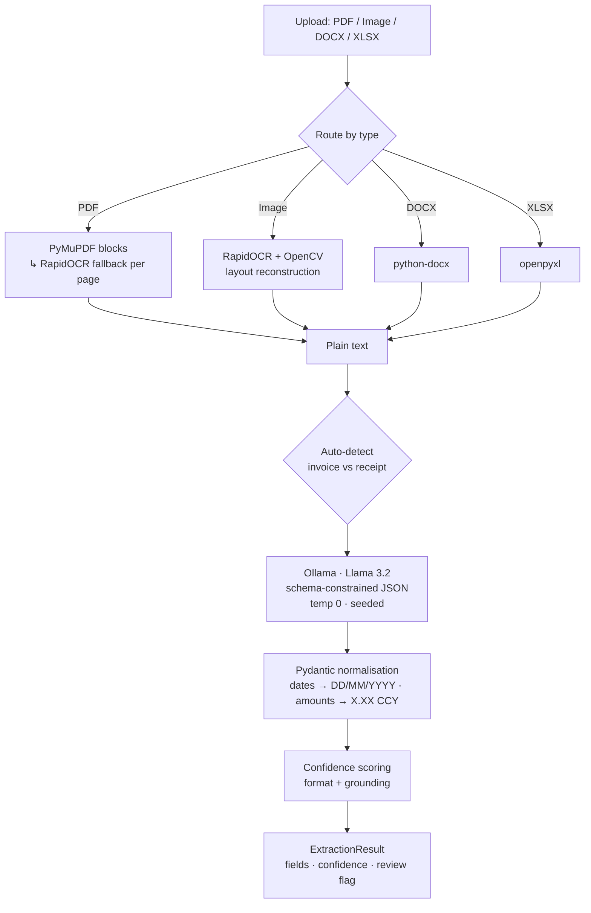

# DocuMind 🧾→ 🔣

**Self-hosted, privacy-first document intelligence.** DocuMind turns messy
financial documents — PDFs, scans, photos, Word, Excel — into clean, validated,
**confidence-scored** JSON, using a two-stage OCR + local-LLM pipeline. No cloud
APIs, no keys, no data leaving your infrastructure.

[](https://github.com/Ayush21-AI/DocuMind/actions/workflows/ci.yml)


-000000)


---

## Live demo

**Run it locally in 10 seconds — no LLM or GPU needed:**

```bash
pip install -r demo/requirements.txt
python demo/app.py        # opens a Gradio UI in your browser
```

The demo runs the *real* classifier, Pydantic validators and confidence scorer
on bundled invoices/receipts — colour-coding each field by confidence and
flagging a low-quality scan for review. See [Deploy the demo free](#deploy-the-demo-free)
to host it on a Hugging Face Space.

<!-- After deploying, add: 🔗 **Live:** https://huggingface.co/spaces/<you>/documind-demo
     and drop a demo GIF here for the strongest first impression. -->

## The problem

Finance teams lose hours keying data off invoices and receipts into accounting
systems. Generic OCR returns raw text; generic LLM extractors return JSON you
can't trust — hallucinated totals, US/UK date confusion, malformed output.

DocuMind targets the *trustworthy extraction* problem: structured fields **plus a
calibrated confidence signal**, so a document can be auto-posted when the system
is sure and routed to a human when it isn't — all **self-hosted**, because
financial documents shouldn't leave your network or depend on a paid API.

## Why it's different

Most invoice extractors stop at "here's some JSON." DocuMind adds the things a
real production system needs — and that almost no comparable open-source project ships:

- **Per-field confidence scores** — every field is scored on *format validity*
  and *grounding* (does the value actually appear in the source?), giving a
  built-in hallucination guard and an auto-accept / needs-review signal.
- **Measured accuracy** — a real evaluation harness with a labelled gold set
  reports precision / recall / F1 per field. Claims, but with numbers.
- **Auto-routing** — one `/extract` endpoint classifies invoice vs receipt and
  picks the right schema; no need to know the document type up front.
- **Schema-constrained decoding** — the Pydantic schema is passed to Ollama's
  `format` parameter, so the model is constrained at the token level to emit
  valid JSON. No more "malformed JSON" failures.
- **Currency-aware normalisation** — detects £/$/€ and ISO codes, strips
  thousands separators, handles negatives, enforces `X.XX`.
- **Observability** — Prometheus `/metrics` (latency, throughput, review rate).
- **One command to run** — `docker compose up` brings up the API *and* a
  model-baked Ollama. Fully tested (37 unit tests), CI-gated.

## Architecture



Two independent services: **`documind-ocr`** (FastAPI, async, OCR + orchestration)
and **`documind-ollama`** (Llama 3.2 baked into the image). Deployable to
Kubernetes via the included Helm values.

## Engineering decisions & trade-offs

| Decision | Chosen | Over | Why |
|---|---|---|---|
| **LLM hosting** | Local Ollama + Llama 3.2 | OpenAI / Gemini APIs | Financial data stays on-prem; no per-call cost, no API keys, works offline. The trade-off — running my own inference — is acceptable for a privacy-sensitive batch workload. |
| **Model size** | `llama3.2:3b` (Q4) | 7B+ models | Best latency on CPU (~3–12s/doc) with solid JSON-following. Benchmarking `qwen2.5:3b` is on the roadmap — it tends to edge out on JSON fidelity, at a license cost. |
| **JSON reliability** | Schema-constrained decoding (`format=<schema>`) | `format:"json"` + regex repair | Constrains generation at the token level to the Pydantic schema, eliminating malformed/renamed-key failures instead of patching them after the fact. |
| **Text extraction** | PyMuPDF first, RapidOCR fallback | OCR every page | Native PDF text is faster and more accurate; OCR is reserved for scanned pages, so the common case stays cheap. |
| **Confidence** | Format-validity + source-grounding | Token logprobs / self-consistency resampling | Deterministic, explainable, and needs **zero extra inference** — and grounding (is the value in the source?) is a direct hallucination guard. |
| **Validation** | Pydantic per-request | Great Expectations | Right tool for the layer: GE validates *datasets*; here every request needs per-field coercion/normalisation with graceful degradation. GE-style checks live in the eval harness instead. |
| **Keeping the model warm** | `keep_alive=-1` + one startup load | A periodic ping loop | Ollama ≥ 0.5 pins the model in memory; the old 10s polling loop was wasted work (and was pinging with the wrong prompt). |

## Accuracy

Generated by `python evaluate.py` against the labelled gold set in
`tests/fixtures/eval/` (sample numbers — regenerate on your own data):

| Field | Exact match | Precision | Recall | F1 | N |
|---|---|---|---|---|---|
| `invoiceNumber` | 1.000 | 1.000 | 1.000 | 1.000 | 4 |
| `totalInvoiceAmount` | 1.000 | 1.000 | 1.000 | 1.000 | 4 |
| `invoiceDate` | 0.750 | 1.000 | 0.750 | 0.857 | 4 |
| `supplierName` | 0.750 | 0.750 | 0.750 | 0.750 | 4 |
| `bankAccountSortCode` | 0.750 | 1.000 | 0.667 | 0.800 | 4 |
| `totalVatAmount` | 0.750 | 0.667 | 0.667 | 0.667 | 4 |
| **macro avg** | **0.833** | — | — | **0.846** | 4 docs |

The harness runs in CI as an accuracy regression guard.

## Data hygiene & robustness

Extraction quality is mostly a data-cleanliness problem, so validation is
layered and defensive — and every layer is unit-tested
(`tests/test_edge_cases.py`):

- **Normalisation at the boundary.** Dates → `DD/MM/YYYY` (US ordering, ISO,
  spelled-out months, two-digit years); amounts → `X.XX <CCY>` (symbol/word
  currency detection, thousands separators stripped, accounting negatives);
  sort codes → `NN-NN-NN`.
- **Graceful degradation.** Anything unparseable becomes `""` — the service
  never raises a validation error back to the caller or invents a value.
- **Hallucination / drift guard.** The grounding check scores down any field
  whose value isn't present in the source text, so a model that starts drifting
  shows up as falling confidence rather than silent bad data.
- **Input guards.** File-type allow-list, PDF page cap, and dropped-page logging
  so partial extractions are never reported as complete.
- **Regression guard.** `evaluate.py` against a labelled gold set runs in CI —
  the dataset-level equivalent of the per-request Pydantic checks.

## API

| Method | Endpoint | Purpose |
|---|---|---|
| `POST` | `/extract` | **Auto-detect** document type and extract |
| `POST` | `/process/invoice/` | Force the 8-field invoice schema |
| `POST` | `/process/income/expenses/invoice/` | Force the 3-field receipt schema |
| `GET`  | `/status` | Health / readiness |
| `GET`  | `/metrics` | Prometheus metrics |

All extraction endpoints accept `multipart/form-data` (`file` field) and return
the same envelope:

```jsonc
{
  "document_type": "invoice",
  "fields": {
    "invoiceNumber": "INV-2024-001",
    "invoiceDate": "15/03/2024",
    "totalInvoiceAmount": "1500.50 GBP",
    "supplierName": "Acme Corp Ltd",
    "bankAccountSortCode": "20-15-82"
  },
  "confidence": { "invoiceNumber": 1.0, "invoiceDate": 1.0,
                  "totalInvoiceAmount": 1.0, "supplierName": 0.75 },
  "overall_confidence": 0.94,
  "review_required": false,
  "currency": "GBP",
  "meta": { "model": "llama3.2:latest", "elapsed_ms": 812,
            "routing_confidence": 1.0, "text_chars": 642 }
}
```

**Supported file types:** `.pdf`, `.png`, `.jpg`, `.jpeg`, `.docx`, `.xlsx`

## Quickstart

### One command (recommended)

```bash
docker compose up --build
# API on http://localhost:8000, Ollama on http://localhost:11434
curl -F "file=@invoice.pdf" http://localhost:8000/extract
```

### Local development

```bash
# 1. Ollama + model
docker run -d -p 11434:11434 --name ollama ollama/ollama:0.15.6
docker exec -it ollama ollama pull llama3.2:latest

# 2. API
cd ocr && python -m venv .venv && source .venv/bin/activate
pip install -r requirements.txt
uvicorn ocr.src.main.main:app --host 0.0.0.0 --port 8000 --reload
```

## Testing & evaluation

```bash
pip install -r ocr/requirements-dev.txt   # runtime deps + pytest
pytest                                     # 59 unit tests (validators, confidence, edge cases, parsing)
python evaluate.py                         # field-level accuracy report
```

Tests are pure-Python and mock the LLM, so the suite runs in <1s with no model.

## Deploy the demo free

The `demo/` folder is a self-contained Gradio app (see `demo/README.md` for the
Hugging Face Space card). To host it on a free CPU Space:

```bash
pip install -U huggingface_hub && huggingface-cli login
huggingface-cli repo create documind-demo --type space --space_sdk gradio
# add this repo's `demo/` files + the `ocr/` package to the Space repo, then push
```

The offline sample tab needs no GPU/LLM, so it runs on the free tier; the "Live
API" tab can point at your own `docker compose up` backend.

## Tech stack

FastAPI · Uvicorn (uvloop) · Pydantic v2 · RapidOCR · ONNX Runtime · OpenCV ·
PyMuPDF · python-docx · openpyxl · httpx · Ollama · Llama 3.2 ·
prometheus-client · Docker / Compose · Kubernetes / Helm · GitHub Actions

## Project layout

```
documind/
├── docker-compose.yml          # one-command app + Ollama
├── evaluate.py                 # accuracy evaluation harness
├── demo/                       # Gradio demo (offline samples + live API)
├── ocr/                        # FastAPI + OCR + LLM client
│   └── src/main/
│       ├── main.py             # app, endpoints (incl. /extract), metrics
│       ├── classifier.py       # invoice-vs-receipt auto-detection
│       ├── confidence.py       # per-field confidence scoring
│       ├── invoice_processor/  # schema-constrained Ollama client
│       ├── model/              # Pydantic schemas + ExtractionResult envelope
│       ├── text_extractor/     # PDF / image / DOCX / XLSX extractors
│       ├── utils/              # currency + date normalisation
│       └── image_processing_utils/
├── ollama/                     # Ollama service (model pre-baked)
└── tests/                      # 59 tests + eval fixtures
```

## Roadmap

- Bounding-box overlay: render extracted fields back onto the source document.
- Batch / ZIP upload with aggregated CSV export.
- Embeddings-based document dedup and vendor matching.

---

*Built by Ayush Gour as a portfolio demonstration of an end-to-end, production-shaped AI document-processing system. MIT licensed.*
